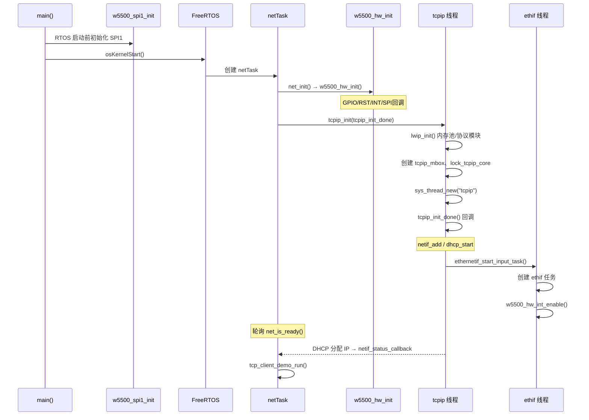

# lwIP 代码逻辑说明

> 本文档描述本工程中 lwIP 的**初始化、接收、处理、发送**完整调用链，以及涉及的**任务/线程/中断**。  
> 配套移植说明见：[LwIP_W5500_移植说明.md](./LwIP_W5500_移植说明.md)

---

## 1. 总体结构

本工程采用 **NO_SYS=0**（多线程模式）：

- lwIP 协议栈运行在专用 **`tcpip` 线程**中。
- 以太网帧通过 W5500 **MACRAW** 模式收发，驱动层在 **`ethif` 线程**。
- 应用层使用 **BSD Socket API**（`socket/connect/send/recv`），API 内部通过消息投递到 `tcpip` 线程执行。

```
┌──────────────┐     socket API      ┌──────────────┐
│   netTask    │ ──────────────────► │  tcpip 线程   │
│ (应用/ demo) │                     │  (lwIP 核心)  │
└──────────────┘                     └───────┬──────┘
                                           │ netif->output / linkoutput
┌──────────────┐     信号量唤醒          │
│  ethif 线程   │ ◄── INT 中断 ──────────┤
└──────┬───────┘                        │
       │ recvfrom / sendto              │
       ▼                                ▼
┌──────────────────────────────────────────────┐
│  W5500 (Socket0 MACRAW)  ←SPI1→  w5500_hw   │
└──────────────────────────────────────────────┘
```

---

## 2. 涉及的任务与中断

### 2.1 与 lwIP 直接相关的执行体

| 名称 | 类型 | 源文件 | 栈大小 | 优先级 | 职责 |
|------|------|--------|--------|--------|------|
| **`tcpip`** | FreeRTOS 任务 | lwIP `tcpip.c` | 1024 words | **5** (`configMAX_PRIORITIES-2`) | lwIP 内核：协议处理、定时器、DHCP、Socket API 消息 |
| **`ethif`** | FreeRTOS 任务 | `ethernetif.c` | 512 words | **4** (`TCPIP_THREAD_PRIO-1`) | 等待 W5500 中断信号量，读 MACRAW 帧并送入 lwIP |
| **`netTask`** | CMSIS-RTOS 线程 | `net_init.c` | 512 words | Normal | 调用 `net_init()`，等 DHCP 完成，运行 TCP demo |

### 2.2 中断（非任务）

| 名称 | 源文件 | 职责 |
|------|--------|------|
| **`EXTI1_IRQHandler`** | `stm32l4xx_it.c` | W5500 INT 引脚（PB1）下降沿 → `ethernetif_notify_rx()` 释放信号量 |

### 2.3 启动前（main，非 RTOS 任务）

| 步骤 | 函数 | 文件 | 说明 |
|------|------|------|------|
| SPI1 初始化 | `w5500_spi1_init()` | `w5500_hw.c` | 在 `osKernelStart()` 之前执行，配置 10 MHz SPI |

### 2.4 工程中其他任务（与 lwIP 无直接耦合）

| 任务 | 说明 |
|------|------|
| `defaultTask` | USB / FreeMaster 轮询 |
| `wifiTask` | ESP8266 AT 命令（独立 UART 网络，不走 lwIP） |
| `modbusTask` | Modbus RTU（USART3） |
| `tc214bTask` | 业务任务 |
| `lvglTask` | LVGL 已关闭（`CONFIG_MODULE_LVGL_ENABLE=0` 时不创建） |

**结论：lwIP 相关共 3 个任务 + 1 个 EXTI 中断。**

---

## 3. 初始化流程

### 3.1 时序总览



### 3.2 阶段一：main 中硬件准备

**文件：** `Core/Src/main.c`

```c
MX_SPI3_Init();
w5500_spi1_init();   // SPI1 @ 10MHz，PA5/6/7
// ...
osKernelStart();
```

此时仅完成 SPI 外设配置，**尚未**与 W5500 通信。

### 3.3 阶段二：netTask 启动网络

**文件：** `APP/net_init.c` → `net_task()`

```c
net_init();                    // 见下节
while (!net_is_ready()) {      // 等 DHCP 拿到 IP
    osDelay(200);
}
tcp_client_demo_run();         // TCP 客户端 demo
```

**`net_init()` 做两件事：**

```c
void net_init(void)
{
    w5500_hw_init();           // ① W5500 硬件 + ioLibrary 回调
    tcpip_init(tcpip_init_done, NULL);  // ② 启动 lwIP
}
```

### 3.4 阶段三：`w5500_hw_init()`（驱动层）

**文件：** `Middlewares/Third_Party/LwIP/port/w5500_hw.c`

| 步骤 | 动作 |
|------|------|
| 1 | 创建 SPI 互斥锁 `s_w5500_spi_mutex` |
| 2 | 配置 PA4(CS)、PB0(RST)、PB1(INT 下降沿) |
| 3 | `w5500_hw_reset()` 硬复位芯片 |
| 4 | `reg_wizchip_*_cbfunc()` 注册 SPI/CS/临界区回调 |

ioLibrary 后续所有 `WIZCHIP_READ/WRITE` 都通过这些回调走 SPI1。

### 3.5 阶段四：`tcpip_init()`（lwIP 内核）

**文件：** `lwip/src/api/tcpip.c`

```c
void tcpip_init(tcpip_init_done_fn initfunc, void *arg)
{
    lwip_init();                              // 初始化内存池、memp、各协议模块
    sys_mbox_new(&tcpip_mbox, ...);           // tcpip 消息邮箱
    sys_mutex_new(&lock_tcpip_core);          // 核心锁（LWIP_TCPIP_CORE_LOCKING=1）
    sys_thread_new("tcpip", tcpip_thread, ...); // 创建 tcpip 任务
}
```

`tcpip_thread` 启动后会调用用户注册的 **`tcpip_init_done`** 回调。

### 3.6 阶段五：`tcpip_init_done()`（注册网卡）

**文件：** `APP/net_init.c`

```c
static void tcpip_init_done(void *arg)
{
    // IP 先设为 0.0.0.0，由 DHCP 后续分配
    netif_add(&g_netif, &ipaddr, &netmask, &gw,
              NULL, ethernetif_init, ethernet_input);
    netif_set_default(&g_netif);
    netif_set_status_callback(&g_netif, netif_status_callback);
    netif_set_up(&g_netif);
    netif_set_link_up(&g_netif);
    dhcp_start(&g_netif);                      // 启动 DHCP 客户端
    ethernetif_start_input_task(&g_netif);     // 创建 ethif 收包任务
}
```

**`netif_add` 参数含义：**

| 参数 | 本工程取值 | 作用 |
|------|-----------|------|
| `initfunc` | `ethernetif_init` | 初始化 netif 结构、绑定 `linkoutput` |
| `input` | `ethernet_input` | 收到以太网帧后的**上层入口** |

### 3.7 阶段六：`ethernetif_init()` / `low_level_init()`（网卡驱动）

**文件：** `Middlewares/Third_Party/LwIP/port/ethernetif.c`

```c
err_t ethernetif_init(struct netif *netif)
{
    netif->output     = etharp_output;      // IP 包 → 解析 MAC → 发以太网帧
    netif->linkoutput = low_level_output;   // 真正写 W5500 硬件
    low_level_init(netif);
}
```

**`low_level_init()` 关键步骤：**

1. `ctlwizchip(CW_INIT_WIZCHIP)` — 分配 W5500 内部 Socket 缓冲（Socket0 占 16KB TX/RX）。
2. 读取/设置 MAC 地址（默认 `02:00:00:12:34:56`）。
3. `socket(0, Sn_MR_MACRAW, 0, 0)` — 打开 MACRAW 模式。
4. `setSn_IMR` / `setSIMR` — 使能 Socket0 接收中断。

### 3.8 阶段七：启动收包任务

**文件：** `ethernetif.c` → `ethernetif_start_input_task()`

```c
s_rx_sem = xSemaphoreCreateBinary();
sys_thread_new("ethif", ethernetif_thread, netif, 512, TCPIP_THREAD_PRIO - 1);
w5500_hw_int_enable();   // 使能 PB1 EXTI 中断
```

### 3.9 DHCP 完成标志

**文件：** `APP/net_init.c`

```c
static void netif_status_callback(struct netif *netif)
{
    if (netif_is_up(netif) && !ip4_addr_isany(netif_ip4_addr(netif)))
        s_net_ready = 1;   // netTask 检测到后可开始 TCP demo
}
```

DHCP 应答帧的接收/解析在 **`tcpip` 线程**内由 lwIP `dhcp.c` 自动完成，应用只需等待 `net_is_ready()`。

---

## 4. 接收流程

### 4.1 数据路径概览

```
网线 → W5500 PHY/MAC → Socket0 RX 缓冲
  → INT 引脚拉低 → EXTI1 中断
  → ethernetif_notify_rx() 释放 s_rx_sem
  → ethif 线程被唤醒
  → low_level_input() recvfrom 读以太网帧
  → pbuf_alloc 封装
  → netif->input(p, netif) 即 ethernet_input()
  → 按帧类型分发 → ARP / IP / DHCP / TCP ...
```

### 4.2 中断层（ISR）

**文件：** `Core/Src/stm32l4xx_it.c`

```c
void EXTI1_IRQHandler(void)
{
    HAL_GPIO_EXTI_IRQHandler(W5500_INT_Pin);
}

void HAL_GPIO_EXTI_Callback(uint16_t GPIO_Pin)
{
    if (GPIO_Pin == W5500_INT_Pin)
        ethernetif_notify_rx();   // 仅释放信号量，不做 SPI 读
}
```

**设计要点：** ISR 中**不**读 SPI、**不**调用 lwIP API，只通知 `ethif` 任务，避免 ISR 执行时间过长及线程安全问题。

### 4.3 ethif 收包线程

**文件：** `ethernetif.c` → `ethernetif_thread()`

```c
for (;;)
{
    xSemaphoreTake(s_rx_sem, portMAX_DELAY);

    LOCK_TCPIP_CORE();                    // 获取 lwIP 核心锁
    ethernetif_input(netif);              // 循环读帧
    setSn_IR(ETH_SOCK, getSn_IR(ETH_SOCK)); // 清除 W5500 Socket 中断
    UNLOCK_TCPIP_CORE();
}
```

### 4.4 底层读帧：`low_level_input()`

```c
len = getSn_RX_RSR(ETH_SOCK);             // 查询 RX 缓冲数据量
len = recvfrom(ETH_SOCK, rx_buf, len, NULL, NULL);  // ioLibrary 读 MACRAW
p = pbuf_alloc(PBUF_RAW, len, PBUF_POOL); // 分配 lwIP 缓冲
memcpy → pbuf 链
return p;
```

### 4.5 送入协议栈：`ethernetif_input()`

```c
while (getSn_RX_RSR(ETH_SOCK) > 0)
{
    p = low_level_input();
    netif->input(p, netif);    // 即 ethernet_input()
}
```

### 4.6 以太网层分发：`ethernet_input()`

**文件：** `lwip/src/netif/ethernet.c`

根据以太网头 **Type 字段**分发：

| Type | 处理函数 | 典型用途 |
|------|----------|----------|
| `0x0806` | `etharp_input()` | ARP 请求/应答 |
| `0x0800` | `ip4_input()` | IPv4（含 ICMP、UDP、TCP、DHCP） |
| 其他 | 丢弃或统计 | — |

**DHCP 报文路径（接收）：**

```
ethernet_input → ip4_input → udp_input → dhcp_recv → 更新 netif IP
                                                      → netif_status_callback
```

**TCP 报文路径（接收，以 demo 为例）：**

```
ethernet_input → ip4_input → tcp_input → TCP PCB 接收缓冲
                                         → socket 层可读
                                         → netTask 中 recv() 返回数据
```

---

## 5. 协议处理（lwIP 内部）

所有以下处理均在 **`tcpip` 线程**上下文中执行（直接或通过 `LOCK_TCPIP_CORE` 加锁）。

### 5.1 tcpip 线程主循环

**文件：** `lwip/src/api/tcpip.c` → `tcpip_thread()`

```c
while (1) {
    tcpip_mbox_fetch(&tcpip_mbox, &msg);   // 等待消息（含超时处理 sys_check_timeouts）
    tcpip_thread_handle_msg(msg);          // 处理 API 消息 / 输入包 / 回调
}
```

**两类消息来源：**

1. **定时器**：TCP 重传、DHCP 超时、ARP 老化等（`sys_check_timeouts`）。
2. **API 消息**：应用调用 `socket/send/connect` 时，`api_lib.c` 向 `tcpip_mbox` 投递 `TCPIP_MSG_API`。

### 5.2 核心锁机制

本工程 `LWIP_TCPIP_CORE_LOCKING = 1`：

- `ethif` 线程在调用 `netif->input()` 前 **`LOCK_TCPIP_CORE()`**。
- 保证 `ethernet_input` 与 `tcpip` 线程不会并发修改协议栈状态。

### 5.3 ARP 的作用

发送 IP 包前，若不知道目标 MAC：

```
ip4_output → netif->output (etharp_output)
           → 查 ARP 缓存
           → 无条目则发 ARP Request，缓存 pbuf 等待
           → 收到 ARP Reply 后 low_level_output 发出排队 IP 包
```

---

## 6. 发送流程

### 6.1 应用层发送（TCP demo）

**文件：** `APP/tcp_client_demo.c`

```c
sock = socket(AF_INET, SOCK_STREAM, 0);
connect(sock, &server_addr, ...);
send(sock, TCP_DEMO_SEND_MSG, len, 0);
```

### 6.2 Socket API → tcpip 线程

**文件：** `lwip/src/api/sockets.c` / `api_msg.c`

```
send()
  → lwip_send() / netconn_write
  → 构造 TCPIP_MSG_API 消息
  → sys_mbox_post(tcpip_mbox)
  → tcpip 线程 tcpip_thread_handle_msg()
  → tcp_write() / tcp_output()
```

应用在 `netTask` 中调用 `send()`，**实际 TCP 组包在 `tcpip` 线程**执行。

### 6.3 IP 层 → 以太网层

```
tcp_output → ip4_output → netif->output (etharp_output)
```

`etharp_output` 完成：

1. 确定下一跳 IP（直连或网关）。
2. 解析目标 MAC（ARP 表或发起 ARP 请求）。
3. 构造以太网头，调用 **`netif->linkoutput`**。

### 6.4 驱动层发送：`low_level_output()`

**文件：** `ethernetif.c`

```c
static err_t low_level_output(struct netif *netif, struct pbuf *p)
{
    // 将 pbuf 链拼成连续 buffer
    for (q = p; q != NULL; q = q->next)
        memcpy(&tx_buf[offset], q->payload, q->len);

    sendto(ETH_SOCK, tx_buf, offset, NULL, 0);   // W5500 MACRAW 发送
    return ERR_OK;
}
```

**注意：** `sendto` 是 **ioLibrary** 的 W5500 socket 函数，不是 lwIP 的 socket API。

### 6.5 发送路径简图


---

## 7. 关键函数对照表

| 功能 | 函数 | 文件 |
|------|------|------|
| 应用入口 | `net_task()` | `APP/net_init.c` |
| 网络初始化 | `net_init()` | `APP/net_init.c` |
| lwIP 启动 | `tcpip_init()` | `lwip/src/api/tcpip.c` |
| 注册网卡 | `netif_add()` + `tcpip_init_done()` | `APP/net_init.c` |
| 网卡 init | `ethernetif_init()` | `port/ethernetif.c` |
| W5500 MACRAW 打开 | `low_level_init()` | `port/ethernetif.c` |
| 硬件/SPI | `w5500_hw_init()` | `port/w5500_hw.c` |
| 中断通知 | `ethernetif_notify_rx()` | `port/ethernetif.c` |
| 收包线程 | `ethernetif_thread()` | `port/ethernetif.c` |
| 读硬件 | `low_level_input()` | `port/ethernetif.c` |
| 以太网入口 | `ethernet_input()` | `lwip/src/netif/ethernet.c` |
| 发硬件 | `low_level_output()` | `port/ethernetif.c` |
| DHCP | `dhcp_start()` / `dhcp_recv()` | `lwip/src/core/ipv4/dhcp.c` |
| TCP 客户端 | `tcp_client_demo_run()` | `APP/tcp_client_demo.c` |

---

## 8. 线程间同步关系

```
                    ┌─────────────────┐
                    │   tcpip_mbox    │  ◄── socket/connect/send API
                    └────────┬────────┘
                             │
┌──────────────┐    ┌────────▼────────┐    ┌──────────────┐
│  EXTI1 ISR   │───►│  s_rx_sem       │───►│  ethif 线程   │
└──────────────┘    └─────────────────┘    └──────┬───────┘
                                                     │ LOCK_TCPIP_CORE
                                                     ▼
                                            ┌─────────────────┐
                                            │  tcpip 线程      │
                                            │  (协议栈核心)    │
                                            └─────────────────┘

┌──────────────┐
│ s_w5500_spi  │  ◄── ioLibrary SPI 读写互斥（多任务可能访问 W5500）
│   _mutex     │
└──────────────┘
```

| 同步对象 | 类型 | 作用 |
|----------|------|------|
| `tcpip_mbox` | 邮箱 | 应用 API 与 tcpip 线程通信 |
| `lock_tcpip_core` | 互斥锁 | ethif 线程安全调用 `ethernet_input` |
| `s_rx_sem` | 二值信号量 | INT 中断 → ethif 线程 |
| `s_w5500_spi_mutex` | 互斥锁 | 保护 SPI1 访问 W5500 |

---

## 9. 读代码建议顺序

若需从头理解本工程 lwIP 逻辑，建议按以下顺序阅读：

1. `APP/net_init.c` — 总入口与初始化顺序  
2. `Middlewares/Third_Party/LwIP/port/w5500_hw.c` — SPI/GPIO 硬件  
3. `Middlewares/Third_Party/LwIP/port/ethernetif.c` — 收发包驱动  
4. `Core/Src/stm32l4xx_it.c` — 中断到收包任务的桥梁  
5. `lwip/src/netif/ethernet.c` — `ethernet_input` 帧分发  
6. `lwip/src/api/tcpip.c` — tcpip 线程模型  
7. `APP/tcp_client_demo.c` — 应用层 Socket 使用示例  

---

## 10. 常见问题（逻辑层面）

**Q：为什么收包要单独 `ethif` 任务，不直接在 tcpip 线程里读 W5500？**  
A：W5500 通过 INT 引脚异步通知；用独立任务 + 信号量，ISR 足够短，读 SPI 在任务上下文进行，再通过 `LOCK_TCPIP_CORE` 安全调用 lwIP。

**Q：`netTask` 和 `tcpip` 线程有什么区别？**  
A：`netTask` 是用户应用任务（等 DHCP、跑 demo）；`tcpip` 是 lwIP 官方内核线程，处理所有协议与 Socket API 消息。

**Q：发送时 `send()` 会阻塞在哪个线程？**  
A：调用发生在 `netTask`，但 TCP 组包与 `low_level_output` 在 **`tcpip` 线程**（或持锁的 ethif 线程，仅 linkoutput 路径）执行；`send()` 可能阻塞等待 tcpip 处理完成。

**Q：DHCP 谁在处理？**  
A：完全由 lwIP `dhcp.c` 在 **`tcpip` 线程**处理；驱动只负责把 DHCP UDP 以太网帧收上来。

---

*文档与工程源码同步，以 `APP/`、`Middlewares/Third_Party/LwIP/port/` 及 lwIP 2.2.1 源码为准。*
